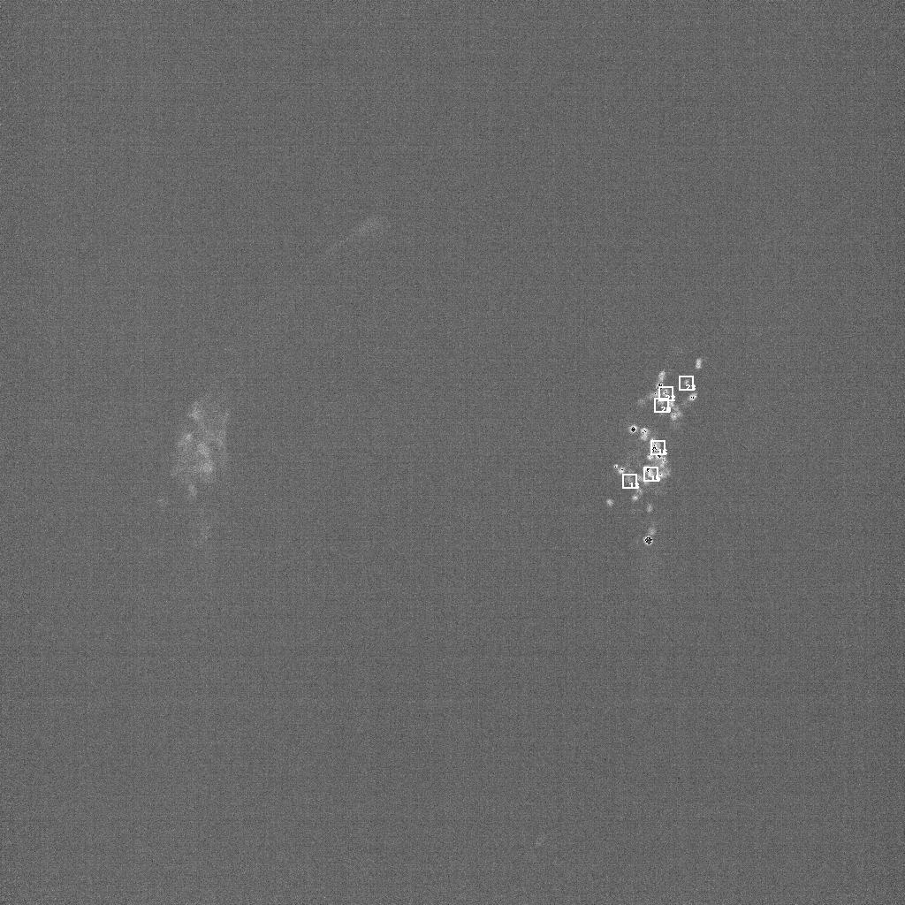
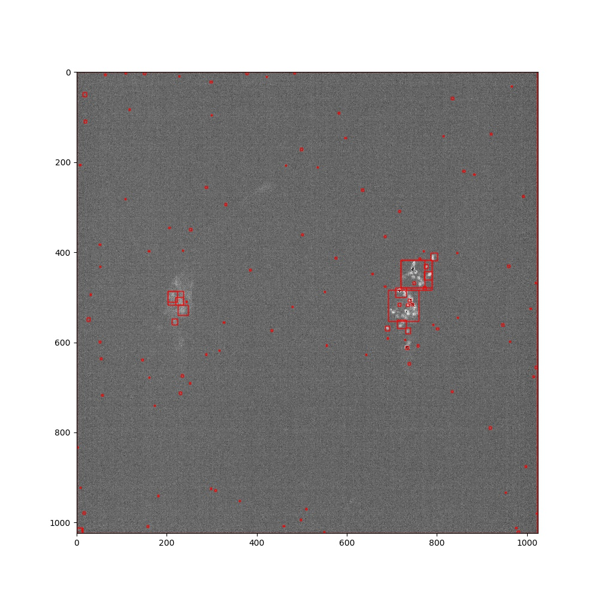
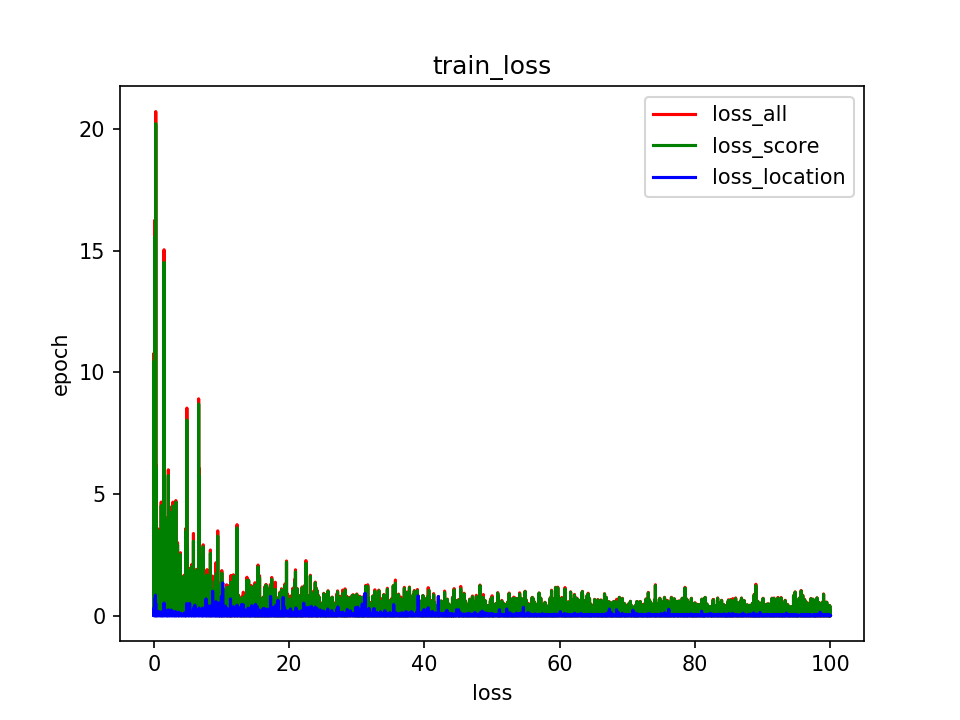
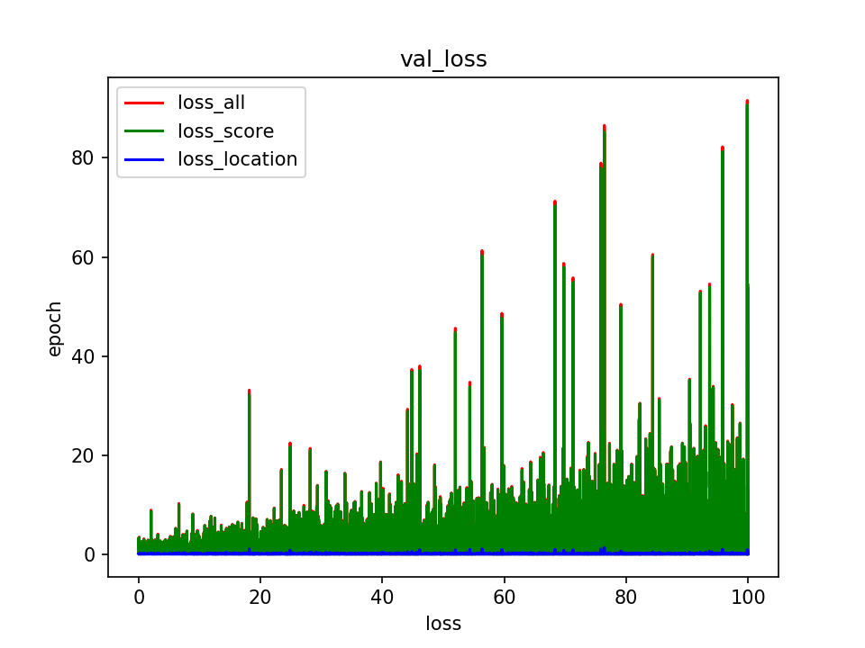

# fast-rcnn-worm

Now we have a microsection video for worm with 50 frames, and each frame has 23 layers of one-channel pictures with size 1024\*1024. We also have the label data of each picture for locating the worm's 107 neurons.

This is a repo applying fast-rcnn to the separated pictures for detecting the worm's neurons from one slice of picture.


## RawData

- `./data/img_stack.npy`: (50, 1024, 1024, 23)
- `./data/ordered_neuron_position.npy`: (50, 107, 3)
- example of one slice:


## Codes

- `prepare_ss.py`: uses the default selective search toolbox to find the candidates rectangles for further training. Results as shown below:

The current codes is not efficient, costing about 7 hrs for all pictures. The effect is not that good either. As you may see in the picture above, red boxes aren't really covering all groundtruth (white boxes).
- `prepare_data.py`: after executing `prepare_ss.py`, this python script generates the npz-format dataset for training.
- `train.py`: mainly uses a vgg16 net. The first conv layer is edited to receive brightness map of one channel, and the last pooling layer is relaced with roi_pooling. Loss is composed of two components: loss of classification score and loss of location.
- `test.py`: performs the forward operation on one picture to obtain the predicted neurons.
- `view_train_result.py`: visualizes the training result.



## Notice

The whole repo (with all the data preprocessed and model trained for 100 epochs) is put in `/home/gyf/mark-worm-frcn/`. 

If you want to continue training, pls uncomment line 198 of `train.py`:

```python
# rcnn.load_state_dict(torch.load('model/worm_0623.mdl'))若继续训练，uncomment
```

If you want to optimize the pre-selection method, pls delete all the generated files and make sure the directory structure is the same as that shown in github repo. Then edit `prepare_ss.py`, and rerun the follow-up process.

## TODO

- use uniform sampling instead of selective search to get the candidate bounding boxes. (Since the patchsize is decided by ourselves, it doesn't have obvious physical characteristics.)
- adjust network structure